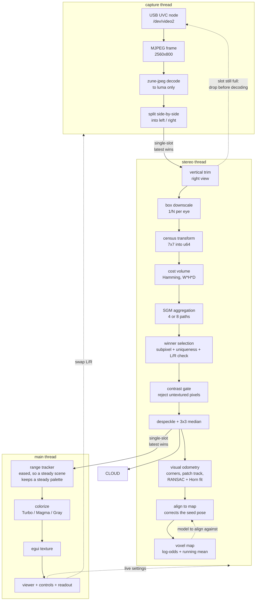
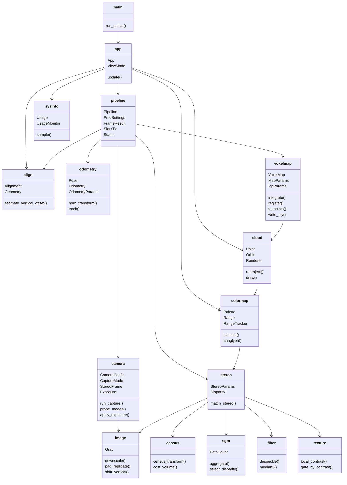
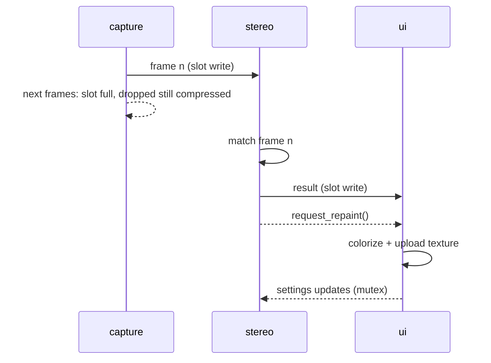

# Architecture

## Data flow

## Modules

## Threading and back pressure

Three rates coexist: the camera can push 120 fps, a wide disparity search takes
tens of milliseconds, and the UI repaints on demand. Both hand-offs are
single-slot mailboxes rather than queues, so a frame that arrives while the
previous one is still being matched replaces it. Latency stays flat and the
`dropped` counter in the status bar shows how much headroom is missing.

